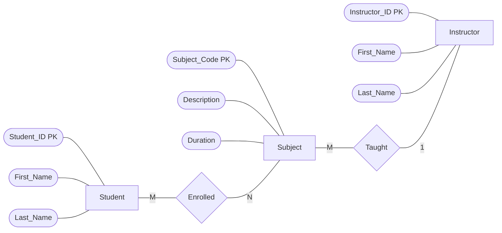
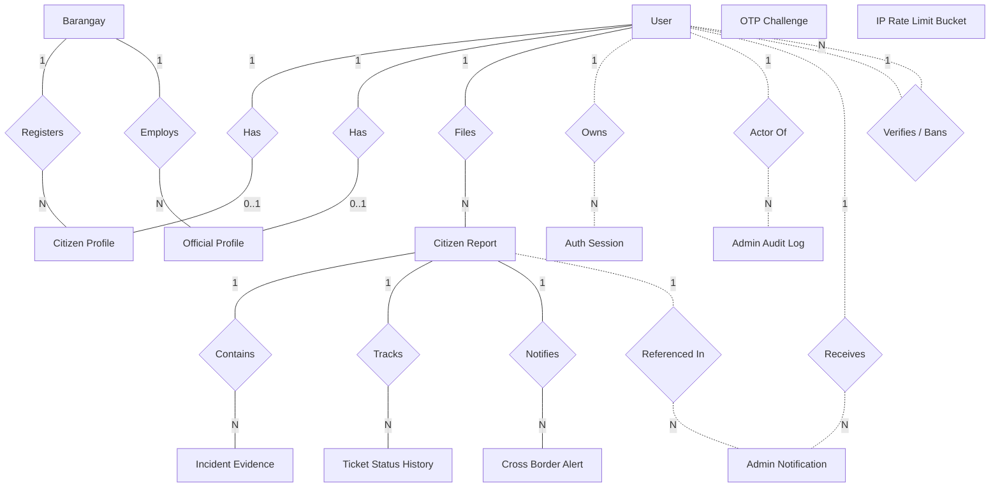
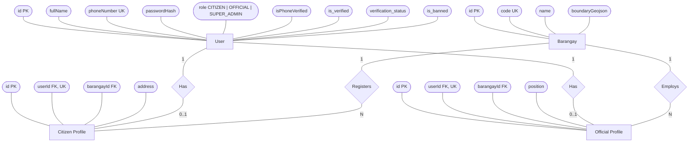

# TUGON — Entity Relationship Diagram (Chen Notation)

> Source of truth: [server/prisma/schema.prisma](../server/prisma/schema.prisma) — verified against live Supabase SQL schema.
> Generated: 2026-04-18

**Note on column names**: most columns are camelCase in the database. However, the `User` table mixes camelCase (`fullName`, `phoneNumber`, `passwordHash`, `role`, `isPhoneVerified`, `createdAt`, `updatedAt`) with **snake_case** for the verification/ban fields (`is_verified`, `id_image_url`, `verification_status`, etc.) — these are `@map`-ed in Prisma. The diagrams below use the *actual database column names*.

**Note on data types**: per the submission rubric, attributes are shown **without** SQL/primitive data types (no `text`, `int`, `timestamp`, etc.). Only the attribute names, key markers (`PK`, `FK`, `UK`), and domain constraints (enum values, `CHECK:` lists) are displayed.

System: **TUGON — Web-Based Incident Management and Decision Support System using Geospatial Analytics**
Scope: Barangays 251, 252, and 256 — Tondo, Manila
DBMS: PostgreSQL (Supabase) via Prisma ORM

---

## 0. Chen Notation Key

This ERD follows the **Chen notation** style required by the rubric:

| Shape                   | Meaning                                                               |
|-------------------------|-----------------------------------------------------------------------|
| **Rectangle**           | Entity — a thing in the system (`User`, `Citizen Report`, etc.)      |
| **Diamond**             | Relationship — how entities interact (`Files`, `Contains`, etc.)     |
| **Oval / pill**         | Attribute — a property of an entity (`phoneNumber`, `latitude`)      |
| **Solid line**          | Enforced foreign-key relationship                                     |
| **Dashed line**         | Logical relationship (ID reference without a Prisma `@relation`)     |

**Cardinality labels on connector lines:** `1` = exactly one · `M` / `N` = many · `0..1` = zero or one · `0..N` = zero or many.

Key markers inside attribute ovals: `PK` = primary key · `FK` = foreign key · `UK` = unique constraint.

### Reference example (matches rubric layout)



---

## 1. Master Relationship Map — All Entities

This skeleton view shows all **13 entities** and the **relationships** connecting them. Attribute ovals are omitted here for readability — full attribute detail appears in the per-subsystem diagrams below.



`OTP_CHALLENGE` and `IP_RATE_LIMIT_BUCKET` are stand-alone entities — they reference phone numbers / IP keys without a foreign key to any other entity, so they appear without relationship lines.

---

## 2. Core Subsystem — Users, Profiles & Barangay



**Cardinality rules**
- A **User** has **at most one** `CitizenProfile` *or* `OfficialProfile` (role-dependent). `SUPER_ADMIN` has neither.
- A **Barangay** has **zero-or-many** citizens and **zero-or-many** officials.
- `barangayId` on both profile tables is **mandatory** — enforces Hard Rule #10 (barangay set at registration).

---

## 3. Incident Reporting Subsystem

```mermaid
flowchart TB
    %% Entities
    USER[User]
    CITIZEN_REPORT[Citizen Report]
    INCIDENT_EVIDENCE[Incident Evidence]
    TICKET_STATUS_HISTORY[Ticket Status History]
    CROSS_BORDER_ALERT[Cross Border Alert]

    %% Relationships
    R_FILES{Files}
    R_CONTAINS{Contains}
    R_TRACKS{Tracks}
    R_NOTIFIES{Notifies}

    %% Citizen Report attributes
    cr_id(["id PK"])
    cr_uid(["citizenUserId FK"])
    cr_brgy([routedBarangayCode])
    cr_lat([latitude])
    cr_lng([longitude])
    cr_cat(["category CHECK: Pollution | Noise | Crime | Road Hazard | Other"])
    cr_sub(["subcategory CHECK: 17 values"])
    cr_status(["status SUBMITTED | UNDER_REVIEW | IN_PROGRESS | RESOLVED | CLOSED | UNRESOLVABLE"])
    cr_sev(["severity low | medium | high | critical"])
    cr_desc([description])
    cr_id --- CITIZEN_REPORT
    cr_uid --- CITIZEN_REPORT
    cr_brgy --- CITIZEN_REPORT
    cr_lat --- CITIZEN_REPORT
    cr_lng --- CITIZEN_REPORT
    cr_cat --- CITIZEN_REPORT
    cr_sub --- CITIZEN_REPORT
    cr_status --- CITIZEN_REPORT
    cr_sev --- CITIZEN_REPORT
    cr_desc --- CITIZEN_REPORT

    %% Incident Evidence attributes
    ie_id(["id PK"])
    ie_rid(["reportId FK"])
    ie_kind(["kind photo | voice"])
    ie_path([storagePath])
    ie_url([publicUrl])
    ie_id --- INCIDENT_EVIDENCE
    ie_rid --- INCIDENT_EVIDENCE
    ie_kind --- INCIDENT_EVIDENCE
    ie_path --- INCIDENT_EVIDENCE
    ie_url --- INCIDENT_EVIDENCE

    %% Ticket Status History attributes
    tsh_id(["id PK"])
    tsh_rid(["reportId FK"])
    tsh_status([status])
    tsh_actor([actor])
    tsh_ar([actorRole])
    tsh_note([note])
    tsh_id --- TICKET_STATUS_HISTORY
    tsh_rid --- TICKET_STATUS_HISTORY
    tsh_status --- TICKET_STATUS_HISTORY
    tsh_actor --- TICKET_STATUS_HISTORY
    tsh_ar --- TICKET_STATUS_HISTORY
    tsh_note --- TICKET_STATUS_HISTORY

    %% Cross Border Alert attributes
    cba_id(["id PK"])
    cba_rid(["reportId FK"])
    cba_src([sourceBarangayCode])
    cba_tgt([targetBarangayCode])
    cba_reason([alertReason])
    cba_id --- CROSS_BORDER_ALERT
    cba_rid --- CROSS_BORDER_ALERT
    cba_src --- CROSS_BORDER_ALERT
    cba_tgt --- CROSS_BORDER_ALERT
    cba_reason --- CROSS_BORDER_ALERT

    %% Relationships with cardinality
    USER ---|1| R_FILES
    R_FILES ---|N| CITIZEN_REPORT
    CITIZEN_REPORT ---|1| R_CONTAINS
    R_CONTAINS ---|N| INCIDENT_EVIDENCE
    CITIZEN_REPORT ---|1| R_TRACKS
    R_TRACKS ---|N| TICKET_STATUS_HISTORY
    CITIZEN_REPORT ---|1| R_NOTIFIES
    R_NOTIFIES ---|N| CROSS_BORDER_ALERT
```



**Cardinality rules**
- A **CitizenReport** belongs to **exactly one** `User` (the reporter) and has **zero-or-many** evidences, status-history rows, and cross-border alerts.
- `CROSS_BORDER_ALERT` has `@@unique([reportId, targetBarangayCode])` — a report can alert each neighbor **at most once**.
- `TICKET_STATUS_HISTORY` is append-only — enforces Hard Rule #11.

---

## 4. Security, Audit & Operations Subsystem

```mermaid
flowchart TB
    %% Entities
    USER[User]
    AUTH_SESSION[Auth Session]
    ADMIN_AUDIT_LOG[Admin Audit Log]
    ADMIN_NOTIFICATION[Admin Notification]
    OTP_CHALLENGE[OTP Challenge]
    IP_RATE_LIMIT_BUCKET[IP Rate Limit Bucket]

    %% Relationships (all logical — no enforced FK)
    R_OWNS_AS{Owns}
    R_ACTOR_AL{Actor Of}
    R_RECV_AN{Receives}

    %% Auth Session attributes
    as_id(["id PK"])
    as_sid(["sessionId UK"])
    as_uid([userId])
    as_th(["tokenHash UK"])
    as_exp([expiresAt])
    as_rv([revokedAt])
    as_id --- AUTH_SESSION
    as_sid --- AUTH_SESSION
    as_uid --- AUTH_SESSION
    as_th --- AUTH_SESSION
    as_exp --- AUTH_SESSION
    as_rv --- AUTH_SESSION

    %% Admin Audit Log attributes
    al_id(["id PK"])
    al_act([actorUserId])
    al_action([action])
    al_tt([targetType])
    al_ti([targetId])
    al_id --- ADMIN_AUDIT_LOG
    al_act --- ADMIN_AUDIT_LOG
    al_action --- ADMIN_AUDIT_LOG
    al_tt --- ADMIN_AUDIT_LOG
    al_ti --- ADMIN_AUDIT_LOG

    %% Admin Notification attributes
    an_id(["id PK"])
    an_rcp([recipientUserId])
    an_kind([kind])
    an_rid([reportId])
    an_read([readAt])
    an_id --- ADMIN_NOTIFICATION
    an_rcp --- ADMIN_NOTIFICATION
    an_kind --- ADMIN_NOTIFICATION
    an_rid --- ADMIN_NOTIFICATION
    an_read --- ADMIN_NOTIFICATION

    %% OTP Challenge attributes
    otp_id(["id PK"])
    otp_phone([phoneNumber])
    otp_purp(["purpose REGISTRATION | PASSWORD_RESET"])
    otp_fva([failedVerifyAttempts])
    otp_lock([lockoutUntil])
    otp_id --- OTP_CHALLENGE
    otp_phone --- OTP_CHALLENGE
    otp_purp --- OTP_CHALLENGE
    otp_fva --- OTP_CHALLENGE
    otp_lock --- OTP_CHALLENGE

    %% IP Rate Limit Bucket attributes
    rl_key(["bucketKey PK"])
    rl_ws([windowStartMs])
    rl_cnt([count])
    rl_key --- IP_RATE_LIMIT_BUCKET
    rl_ws --- IP_RATE_LIMIT_BUCKET
    rl_cnt --- IP_RATE_LIMIT_BUCKET

    %% Logical relationships (dashed)
    USER -.-|1| R_OWNS_AS
    R_OWNS_AS -.-|N| AUTH_SESSION
    USER -.-|1| R_ACTOR_AL
    R_ACTOR_AL -.-|N| ADMIN_AUDIT_LOG
    USER -.-|1| R_RECV_AN
    R_RECV_AN -.-|N| ADMIN_NOTIFICATION
```



**Design note** — `AUTH_SESSION`, `ADMIN_AUDIT_LOG`, `ADMIN_NOTIFICATION`, `OTP_CHALLENGE`, and `IP_RATE_LIMIT_BUCKET` store `userId` / `phoneNumber` / `bucketKey` **without** enforced foreign keys. This is intentional: audit rows must survive user deletion, and rate-limit buckets are keyed by transient IPs.

---

## 5. Entity Summary (13 entities)

| # | Entity | Purpose | Enforced FKs |
|---|--------|---------|--------------|
| 1 | **User** | Identity + auth + verification + ban | self-ref on `verifiedByUserId`, `bannedByUserId` (logical) |
| 2 | **CitizenProfile** | Citizen-specific fields | `userId` → User, `barangayId` → Barangay |
| 3 | **OfficialProfile** | Official-specific fields | `userId` → User, `barangayId` → Barangay |
| 4 | **Barangay** | Jurisdiction + boundary GeoJSON | — |
| 5 | **CitizenReport** | Incident ticket | `citizenUserId` → User |
| 6 | **IncidentEvidence** | Photo / voice attachments | `reportId` → CitizenReport |
| 7 | **CrossBorderAlert** | Informational alerts to neighbors | `reportId` → CitizenReport |
| 8 | **TicketStatusHistory** | Status-change audit trail | `reportId` → CitizenReport |
| 9 | **AdminAuditLog** | Super-admin action log | (logical only) |
| 10 | **AdminNotification** | Inbox for officials / admins | (logical only) |
| 11 | **AuthSession** | JWT session revocation store | (logical only) |
| 12 | **OtpChallenge** | Phone OTP verification | (logical only) |
| 13 | **IpRateLimitBucket** | Per-IP rate limiting | — |

---

## 6. CHECK constraints (domain rules at DB level)

Enforced inside `CitizenReport` — these guarantee Hard Rule #4 (incident types preserved exactly):

**`category`** — one of:
```
Pollution · Noise · Crime · Road Hazard · Other
```

**`subcategory`** — one of 17 values:
```
Air pollution (smoke or fumes)        · Water contamination
Illegal dumping or waste              · Blocked drainage or unsanitary area
Loud music or karaoke                 · Construction noise
Street disturbance noise              · Animal-related noise
Theft or robbery                      · Assault or physical altercation
Vandalism                             · Suspicious activity
Potholes                              · Broken streetlights
Blocked sidewalks                     · Road obstruction or illegal parking
Unlisted general issues
```

The system table `_prisma_migrations` is **excluded** from the ERD — it is managed by Prisma for migration state tracking and is not part of the domain model.

---

## 7. How to view this ERD

The diagrams above use **Mermaid** — a text-based diagramming syntax that renders to Chen-notation ERDs automatically.

### Option A — GitHub (easiest)
Push this file. GitHub renders Mermaid `flowchart` blocks inline. Open `docs/ERD.md` in the repo UI.

### Option B — VS Code
Install either extension:
- **Markdown Preview Mermaid Support** (`bierner.markdown-mermaid`)
- **Mermaid Preview** (`vstirbu.vscode-mermaid-preview`)

Then open [ERD.md](ERD.md) and press `Ctrl+Shift+V` for preview.

### Option C — Mermaid Live Editor (online)
1. Open https://mermaid.live
2. Copy one of the `flowchart` blocks above
3. Paste into the editor — renders instantly
4. Export as PNG / SVG / PDF via the *Actions* menu

### Option D — Export a static image
Install Mermaid CLI:
```bash
npm install -g @mermaid-js/mermaid-cli
mmdc -i docs/ERD.md -o docs/ERD.png
```
