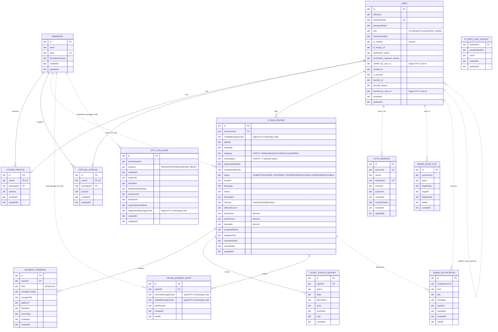
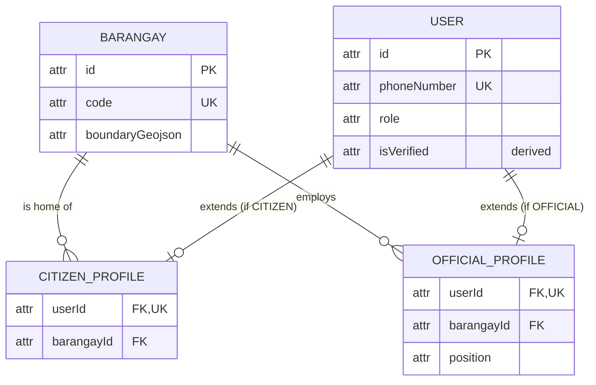
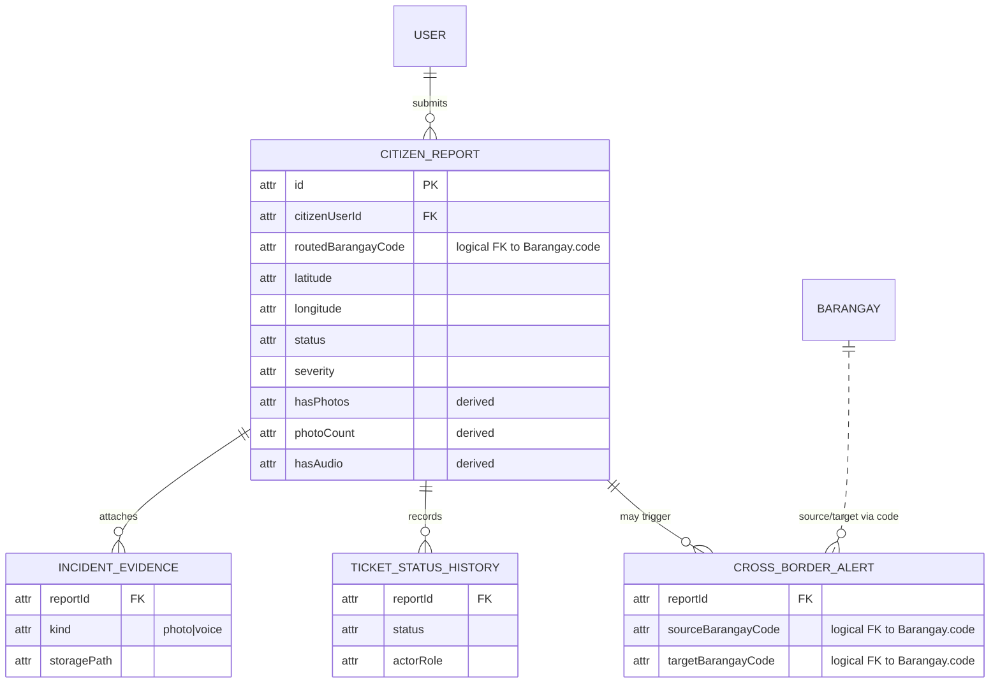
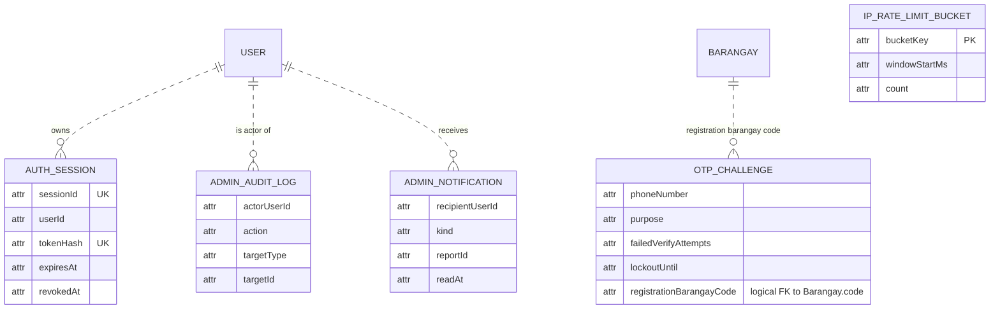

# TUGON — Entity Relationship Diagram (Crow's Foot Notation)

> Source of truth: [server/prisma/schema.prisma](../server/prisma/schema.prisma) — verified against live Supabase SQL schema.
> Generated: 2026-04-18

**Note on column names**: most columns are camelCase in the database. However, the `User` table mixes camelCase (`fullName`, `phoneNumber`, `passwordHash`, `role`, `isPhoneVerified`, `createdAt`, `updatedAt`) with **snake_case** for the verification/ban fields (`is_verified`, `id_image_url`, `verification_status`, etc.) — these are `@map`-ed in Prisma. The diagrams below use the *actual database column names*.

**Note on data types** — per the submission rubric (Prof. Centeno, R2): attributes carry **no SQL/primitive data types** (no `text`, `int`, `boolean`, `timestamp`, etc.). Mermaid `erDiagram` syntax requires *some* token in the type position of each attribute line, so the literal word `attr` is used as a **neutral placeholder**. It is not a real type — treat it as visual padding. Only attribute names, key markers (`PK`, `FK`, `UK`), comments, and enum-value lists are meaningful.

**Note on special attributes**:
- `"derived"` comment = value is computed from other data (denormalized cache). In the draw.io submission these must be drawn as **dashed ovals** per Chen convention (R5).
- `INCIDENT_EVIDENCE`, `TICKET_STATUS_HISTORY`, and `CROSS_BORDER_ALERT` are **weak entities** — they exist only in the context of a `CITIZEN_REPORT` (their `reportId` is part of their identity). Classical notation requires a **double rectangle** for the entity and a **double diamond** for the identifying relationship. Mermaid cannot render these shapes, so they are listed in text in §5 (R4).

System: **TUGON — Web-Based Incident Management and Decision Support System using Geospatial Analytics**
Scope: Barangays 251, 252, and 256 — Tondo, Manila
DBMS: PostgreSQL (Supabase) via Prisma ORM

---

## 1. Master ERD — All Entities



Solid lines = enforced FK. Dashed lines (`..`) = logical relationship (no FK constraint in schema — the column references a `User.id`, `Barangay.code`, or `CitizenReport.id` value but Prisma has no `@relation`).

---

## 2. Core Domain — Users, Profiles, Barangay



**Cardinality rules**
- A **User** has **at most one** `CitizenProfile` *or* `OfficialProfile` (role-dependent). `SUPER_ADMIN` has neither.
- A **Barangay** has **zero-or-many** citizens and **zero-or-many** officials.
- `barangayId` on both profile tables is **mandatory** — enforces Hard Rule #10 (barangay set at registration).

---

## 3. Incident Reporting Subsystem



**Cardinality rules**
- A **CitizenReport** belongs to **exactly one** `User` (the reporter) and has **zero-or-many** evidences, status-history rows, and cross-border alerts.
- `CROSS_BORDER_ALERT` has `@@unique([reportId, targetBarangayCode])` — a report can alert each neighbor **at most once**.
- `TICKET_STATUS_HISTORY` is append-only — enforces Hard Rule #11.

**Weak entities in this subsystem**: `INCIDENT_EVIDENCE`, `TICKET_STATUS_HISTORY`, `CROSS_BORDER_ALERT` — each requires a `reportId` for identity and is meaningless without its parent `CITIZEN_REPORT`.

---

## 4. Security, Audit & Operations Subsystem



**Design note** — `AUTH_SESSION`, `ADMIN_AUDIT_LOG`, `ADMIN_NOTIFICATION`, `OTP_CHALLENGE`, and `IP_RATE_LIMIT_BUCKET` store `userId` / `phoneNumber` / `bucketKey` **without** enforced foreign keys. This is intentional: audit rows must survive user deletion, registration barangay is recorded by code only, and rate-limit buckets are keyed by transient IPs.

---

## 5. Crow's Foot Notation Legend

| Symbol (Mermaid) | Meaning |
|------------------|---------|
| `\|\|--\|\|`     | one and only one — one and only one |
| `\|\|--o\|`      | one and only one — zero or one |
| `\|\|--o{`       | one and only one — zero or many |
| `\|\|--\|{`      | one and only one — one or many |
| `}o--o{`         | zero or many — zero or many |
| `..`             | logical (non-FK) relationship |

### Special markers used in the diagrams

| Marker / Concept | Where it appears | Classical-notation equivalent (for draw.io submission) |
|------------------|------------------|--------------------------------------------------------|
| `attr` (first token) | every attribute line | Not drawn — Mermaid-only placeholder, ignore when redrawing |
| `"derived"` | `is_verified`, `isVerified`, `hasPhotos`, `photoCount`, `hasAudio` | **Dashed oval** (R5 — derived attribute) |
| `PK` | primary-key attributes | **Underlined** attribute name |
| `FK` | foreign-key attributes | Plain oval (relationship line carries the key) |
| `UK` | unique-constraint attributes | No standard Chen symbol — annotated in text |
| Weak entity | `INCIDENT_EVIDENCE`, `TICKET_STATUS_HISTORY`, `CROSS_BORDER_ALERT` | **Double rectangle** + **double-diamond** identifying relationship (R4) |

### Derived attribute sources

| Attribute | Computed from |
|-----------|---------------|
| `User.is_verified` / `isVerified` | `verification_status = APPROVED` |
| `CitizenReport.hasPhotos` | `COUNT(IncidentEvidence WHERE kind = 'photo') > 0` |
| `CitizenReport.photoCount` | `COUNT(IncidentEvidence WHERE kind = 'photo')` |
| `CitizenReport.hasAudio` | `COUNT(IncidentEvidence WHERE kind = 'voice') > 0` |

---

## 6. Entity Summary (13 entities)

| # | Entity | Strength | Purpose | Enforced FKs |
|---|--------|----------|---------|--------------|
| 1 | **User** | Strong | Identity + auth + verification + ban | self-ref on `verifiedByUserId`, `bannedByUserId` (logical) |
| 2 | **CitizenProfile** | Strong | Citizen-specific fields | `userId` → User, `barangayId` → Barangay |
| 3 | **OfficialProfile** | Strong | Official-specific fields | `userId` → User, `barangayId` → Barangay |
| 4 | **Barangay** | Strong | Jurisdiction + boundary GeoJSON | — |
| 5 | **CitizenReport** | Strong | Incident ticket | `citizenUserId` → User |
| 6 | **IncidentEvidence** | **Weak** (depends on CitizenReport) | Photo / voice attachments | `reportId` → CitizenReport |
| 7 | **CrossBorderAlert** | **Weak** (depends on CitizenReport) | Informational alerts to neighbors | `reportId` → CitizenReport |
| 8 | **TicketStatusHistory** | **Weak** (depends on CitizenReport) | Status-change audit trail | `reportId` → CitizenReport |
| 9 | **AdminAuditLog** | Strong | Super-admin action log | (logical only) |
| 10 | **AdminNotification** | Strong | Inbox for officials / admins | (logical only) |
| 11 | **AuthSession** | Strong | JWT session revocation store | (logical only) |
| 12 | **OtpChallenge** | Strong | Phone OTP verification | (logical only) |
| 13 | **IpRateLimitBucket** | Strong | Per-IP rate limiting | — |

---

## 7. CHECK constraints (domain rules at DB level)

Enforced inside `CitizenReport` — these guarantee Hard Rule #4 (incident types preserved exactly):

**`category`** — one of:
```
Pollution · Noise · Crime · Road Hazard · Other
```

**`subcategory`** — one of 17 values:
```
Air pollution (smoke or fumes)        · Water contamination
Illegal dumping or waste              · Blocked drainage or unsanitary area
Loud music or karaoke                 · Construction noise
Street disturbance noise              · Animal-related noise
Theft or robbery                      · Assault or physical altercation
Vandalism                             · Suspicious activity
Potholes                              · Broken streetlights
Blocked sidewalks                     · Road obstruction or illegal parking
Unlisted general issues
```

The system table `_prisma_migrations` is **excluded** from the ERD — it is managed by Prisma for migration state tracking and is not part of the domain model.

---

## 8. How to view this ERD

The diagrams above use **Mermaid** — a text-based diagramming syntax that renders to Crow's Foot ERDs automatically.

### Option A — GitHub (easiest)
Push this file. GitHub renders Mermaid `erDiagram` blocks inline. Open `docs/ERD.md` in the repo UI.

### Option B — VS Code
Install either extension:
- **Markdown Preview Mermaid Support** (`bierner.markdown-mermaid`)
- **Mermaid Preview** (`vstirbu.vscode-mermaid-preview`)

Then open [ERD.md](ERD.md) and press `Ctrl+Shift+V` for preview.

### Option C — Mermaid Live Editor (online)
1. Open https://mermaid.live
2. Copy one of the `erDiagram` blocks above
3. Paste into the editor — renders instantly
4. Export as PNG / SVG / PDF via the *Actions* menu

### Option D — Generate from Prisma (always current)
```bash
npm --prefix server install -D prisma-erd-generator @mermaid-js/mermaid-cli
```
Add to [server/prisma/schema.prisma](../server/prisma/schema.prisma):
```prisma
generator erd {
  provider = "prisma-erd-generator"
  output   = "../../docs/ERD-auto.svg"
}
```
Then run:
```bash
npm --prefix server run prisma:generate
```

### Option E — Export a static image
Install Mermaid CLI:
```bash
npm install -g @mermaid-js/mermaid-cli
mmdc -i docs/ERD.md -o docs/ERD.png
```
