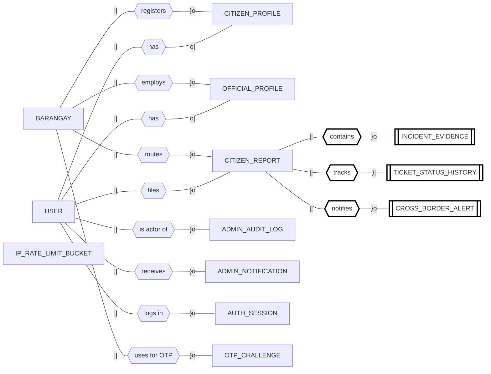
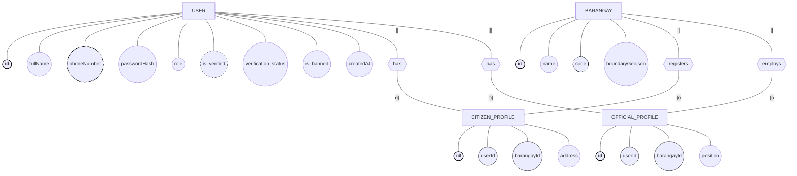
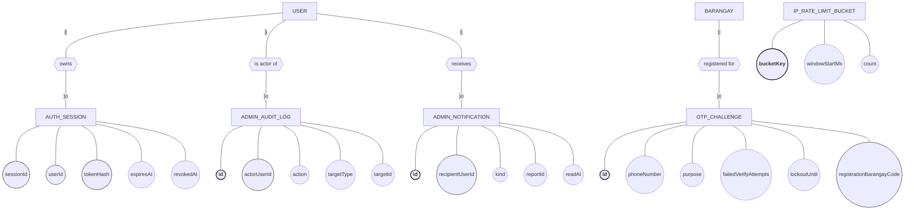

# TUGON — Entity Relationship Diagram (Crow's Foot Notation with Chen-style Attributes)

> Source of truth: [server/prisma/schema.prisma](../server/prisma/schema.prisma) — verified against live Supabase SQL schema.
> Generated: 2026-04-21 · Revised to match the **"ER Diagram Using Crow's Foot Notation"** format on page 34 of the ER Modeling lesson notes.

**Format used (per Prof. Centeno's sample on page 34)**
- **Rectangles** — entity sets (e.g. `USER`, `BARANGAY`, `CITIZEN_REPORT`)
- **Double rectangles** — weak entity sets (e.g. `INCIDENT_EVIDENCE`)
- **Diamonds** — relationship sets (e.g. `files`, `contains`)
- **Ovals** — attributes, attached to their entity by a line
- **Underlined oval text** — key attribute (primary key)
- **Dashed ovals** — derived attributes (e.g. `is_verified`, `hasPhotos`)
- **Crow's Foot markers on edges** — cardinality and connectivity:
  - `||` = mandatory one (one and only one)
  - `o|` = zero or one (optional one)
  - `}|` = one or many (mandatory many)
  - `}o` = zero or many (optional many)

**Note on column names**: most columns are camelCase in the database. However, the `User` table mixes camelCase (`fullName`, `phoneNumber`, `passwordHash`, `role`, `isPhoneVerified`, `createdAt`, `updatedAt`) with **snake_case** for the verification/ban fields (`is_verified`, `id_image_url`, `verification_status`, etc.) — these are `@map`-ed in Prisma. The diagrams below use the *actual database column names*.

**Note on data types** — per rubric R2: attributes carry **no SQL/primitive data types** (no `text`, `int`, `boolean`, `timestamp`, etc.).

System: **TUGON — Web-Based Incident Management and Decision Support System using Geospatial Analytics**
Scope: Barangays 251, 252, and 256 — Tondo, Manila
DBMS: PostgreSQL (Supabase) via Prisma ORM

---

## 1. Master ERD — Entities and Relationships

High-level view: all 13 entities, their relationships (diamonds), and Crow's Foot cardinality markers. Attribute ovals are shown per-entity in §2–§4 for readability.



**Edge-label legend**: `||` = mandatory one · `o|` = zero or one · `}|` = one or many · `}o` = zero or many. Double-bordered rectangles mark **weak entities**; their diamonds (styled `idrel`) are identifying relationships — in the draw.io final submission these should be drawn as **double diamonds**.

---

## 2. Core Domain — User, Profile, Barangay (with Attribute Ovals)

Chen-style attribute ovals attached to each entity; Crow's Foot markers on relationship edges.



**Cardinality rules**
- A **User** has **at most one** `CitizenProfile` *or* `OfficialProfile` (role-dependent). `SUPER_ADMIN` has neither. → `|| — o|`
- A **Barangay** has **zero-or-many** citizens and **zero-or-many** officials. → `|| — }o`
- `barangayId` on both profile tables is **mandatory** — enforces Hard Rule #10 (barangay set at registration).

---

## 3. Incident Reporting Subsystem (Weak Entities)

Weak entities drawn as **double rectangles**, connected by **identifying relationships** (diamonds styled `idrel`; in the final draw.io submission these should be rendered as **double diamonds**).

```mermaid
flowchart TB
    %% ===== Strong Entity =====
    CR[CITIZEN_REPORT]

    %% ===== Weak Entities (double rectangle) =====
    IE[[INCIDENT_EVIDENCE]]:::weak
    TSH[[TICKET_STATUS_HISTORY]]:::weak
    CBA[[CROSS_BORDER_ALERT]]:::weak

    %% ===== Identifying relationships =====
    ID_CONTAINS{{contains}}:::idrel
    ID_TRACKS{{tracks}}:::idrel
    ID_NOTIFIES{{notifies}}:::idrel

    %% ===== CITIZEN_REPORT attributes =====
    CR_id((id)):::key
    CR_uid((citizenUserId)):::fk
    CR_brgy((routedBarangayCode)):::fk
    CR_lat((latitude))
    CR_lng((longitude))
    CR_cat((category))
    CR_sub((subcategory))
    CR_stat((status))
    CR_sev((severity))
    CR_desc((description))
    CR_hp((hasPhotos)):::derived
    CR_pc((photoCount)):::derived
    CR_ha((hasAudio)):::derived
    CR_sub_at((submittedAt))

    CR --- CR_id
    CR --- CR_uid
    CR --- CR_brgy
    CR --- CR_lat
    CR --- CR_lng
    CR --- CR_cat
    CR --- CR_sub
    CR --- CR_stat
    CR --- CR_sev
    CR --- CR_desc
    CR --- CR_hp
    CR --- CR_pc
    CR --- CR_ha
    CR --- CR_sub_at

    %% ===== INCIDENT_EVIDENCE attributes =====
    IE_id((id)):::key
    IE_rid((reportId)):::fk
    IE_kind((kind))
    IE_path((storagePath))
    IE_mime((mimeType))

    IE --- IE_id
    IE --- IE_rid
    IE --- IE_kind
    IE --- IE_path
    IE --- IE_mime

    %% ===== TICKET_STATUS_HISTORY attributes =====
    TSH_id((id)):::key
    TSH_rid((reportId)):::fk
    TSH_stat((status))
    TSH_actor((actor))
    TSH_role((actorRole))
    TSH_at((createdAt))

    TSH --- TSH_id
    TSH --- TSH_rid
    TSH --- TSH_stat
    TSH --- TSH_actor
    TSH --- TSH_role
    TSH --- TSH_at

    %% ===== CROSS_BORDER_ALERT attributes =====
    CBA_id((id)):::key
    CBA_rid((reportId)):::fk
    CBA_src((sourceBarangayCode)):::fk
    CBA_tgt((targetBarangayCode)):::fk
    CBA_reason((alertReason))

    CBA --- CBA_id
    CBA --- CBA_rid
    CBA --- CBA_src
    CBA --- CBA_tgt
    CBA --- CBA_reason

    %% ===== Identifying relationships with Crow's Foot markers =====
    CR ---|"||"| ID_CONTAINS
    ID_CONTAINS ---|"}o"| IE
    CR ---|"||"| ID_TRACKS
    ID_TRACKS ---|"}|"| TSH
    CR ---|"||"| ID_NOTIFIES
    ID_NOTIFIES ---|"}o"| CBA

    classDef weak stroke:#000,stroke-width:3px,fill:#fff
    classDef idrel stroke:#000,stroke-width:3px,fill:#fff
    classDef key stroke:#000,stroke-width:2px,font-weight:bold
    classDef fk stroke:#000,stroke-width:1px
    classDef derived stroke:#000,stroke-width:1px,stroke-dasharray:5 5
```



**Cardinality rules**
- A **CitizenReport** belongs to **exactly one** `User` (the reporter — `||`) and has **zero-or-many** evidences, **one-or-many** status-history rows, and **zero-or-many** cross-border alerts.
- `CROSS_BORDER_ALERT` has `@@unique([reportId, targetBarangayCode])` — a report can alert each neighbor **at most once**.
- `TICKET_STATUS_HISTORY` is append-only (at least one row at creation) — enforces Hard Rule #11, shown as `}|` (one-or-many).

**Weak-entity justification**: each of these entities *cannot be uniquely identified by its own attributes* — their identity depends on the parent `CITIZEN_REPORT` via `reportId`.

---

## 4. Security, Audit & Operations Subsystem



**Design note** — `AUTH_SESSION`, `ADMIN_AUDIT_LOG`, `ADMIN_NOTIFICATION`, `OTP_CHALLENGE`, and `IP_RATE_LIMIT_BUCKET` store `userId` / `phoneNumber` / `bucketKey` **without** enforced foreign keys at the DB level — the cardinality is still shown for conceptual correctness.

---

## 5. Notation Legend (Page-34 Format)

### Shapes (Chen-style)

| Shape | Meaning | In TUGON |
|-------|---------|----------|
| ▭ **Rectangle** | Strong entity set | `USER`, `BARANGAY`, `CITIZEN_REPORT`, etc. |
| ▭▭ **Double rectangle** | Weak entity set | `INCIDENT_EVIDENCE`, `TICKET_STATUS_HISTORY`, `CROSS_BORDER_ALERT` |
| ⬭ **Oval** | Attribute | `fullName`, `phoneNumber`, `latitude`, … |
| ⬭ *underlined* | **Key attribute** | `id` on every entity, `bucketKey` |
| ⬭⬭ **Double oval** | Multivalued attribute | *(none — see §6 note)* |
| ⬭ *dashed* | **Derived attribute** | `is_verified`, `hasPhotos`, `photoCount`, `hasAudio` |
| ⬡ **Diamond** | Relationship set | `has`, `files`, `registers`, `routes`, `owns` |
| ⬡⬡ **Double diamond** | Identifying relationship (draw in draw.io) | `contains`, `tracks`, `notifies` |

### Edge markers (Crow's Foot)

| Marker | Meaning |
|--------|---------|
| `\|\|` (two vertical bars) | Mandatory **one** — exactly one |
| `o\|` (circle + bar) | Optional **one** — zero or one |
| `}\|` (crow's foot + bar) | Mandatory **many** — one or many |
| `}o` (crow's foot + circle) | Optional **many** — zero or many |

### Derived attribute sources

| Attribute | Entity | Computed from |
|-----------|--------|---------------|
| `is_verified` / `isVerified` | `USER` | `verification_status = APPROVED` |
| `hasPhotos` | `CITIZEN_REPORT` | `COUNT(IncidentEvidence WHERE kind = 'photo') > 0` |
| `photoCount` | `CITIZEN_REPORT` | `COUNT(IncidentEvidence WHERE kind = 'photo')` |
| `hasAudio` | `CITIZEN_REPORT` | `COUNT(IncidentEvidence WHERE kind = 'voice') > 0` |

### CSS-class mapping (Mermaid → visual)

| Class | Meaning | Visual equivalent |
|-------|---------|-------------------|
| `key` | Primary key | **Bold** text — redraw as **underlined** oval |
| `uk` | Unique constraint (non-PK) | Dashed border — no standard Chen symbol, annotated only |
| `fk` | Foreign-key attribute | Plain oval (relationship line carries the key) |
| `derived` | Derived attribute | **Dashed** oval |
| `weak` | Weak entity | **Double** rectangle |
| `idrel` | Identifying relationship | **Double** diamond (redraw in draw.io) |

---

## 6. Entity Summary (13 entities)

| # | Entity | Strength | Purpose | Enforced FKs |
|---|--------|----------|---------|--------------|
| 1 | **User** | Strong | Identity + auth + verification + ban | self-ref on `verifiedByUserId`, `bannedByUserId` (logical) |
| 2 | **CitizenProfile** | Strong | Citizen-specific fields | `userId` → User, `barangayId` → Barangay |
| 3 | **OfficialProfile** | Strong | Official-specific fields | `userId` → User, `barangayId` → Barangay |
| 4 | **Barangay** | Strong | Jurisdiction + boundary GeoJSON | — |
| 5 | **CitizenReport** | Strong | Incident ticket | `citizenUserId` → User |
| 6 | **IncidentEvidence** | **Weak** (depends on CitizenReport) | Photo / voice attachments | `reportId` → CitizenReport |
| 7 | **CrossBorderAlert** | **Weak** (depends on CitizenReport) | Informational alerts to neighbors | `reportId` → CitizenReport |
| 8 | **TicketStatusHistory** | **Weak** (depends on CitizenReport) | Status-change audit trail | `reportId` → CitizenReport |
| 9 | **AdminAuditLog** | Strong | Super-admin action log | (logical only) |
| 10 | **AdminNotification** | Strong | Inbox for officials / admins | (logical only) |
| 11 | **AuthSession** | Strong | JWT session revocation store | (logical only) |
| 12 | **OtpChallenge** | Strong | Phone OTP verification | (logical only) |
| 13 | **IpRateLimitBucket** | Strong | Per-IP rate limiting | — |

**Note on multivalued attributes**: TUGON does not use multivalued attributes at the schema level. Concepts that could be multivalued (e.g. a report's photo/voice files) are modeled instead as the **weak entity** `INCIDENT_EVIDENCE` — converting a multivalued attribute into its own entity is a standard normalization and avoids the M:N redundancy the lesson notes warn against.

---

## 7. CHECK constraints (domain rules at DB level)

Enforced inside `CitizenReport` — these guarantee Hard Rule #4 (incident types preserved exactly):

**`category`** — one of:
```
Pollution · Noise · Crime · Road Hazard · Other
```

**`subcategory`** — one of 17 values:
```
Air pollution (smoke or fumes)        · Water contamination
Illegal dumping or waste              · Blocked drainage or unsanitary area
Loud music or karaoke                 · Construction noise
Street disturbance noise              · Animal-related noise
Theft or robbery                      · Assault or physical altercation
Vandalism                             · Suspicious activity
Potholes                              · Broken streetlights
Blocked sidewalks                     · Road obstruction or illegal parking
Unlisted general issues
```

**`status`** — one of 6 values (preserves Hard Rule #3, the canonical ticket lifecycle):
```
Submitted → Under Review → In Progress → Resolved → Closed · Unresolvable
```

The system table `_prisma_migrations` is **excluded** from the ERD — it is managed by Prisma for migration state tracking and is not part of the domain model.

---

## 8. How to view / export this ERD

The diagrams above use **Mermaid `flowchart`** — it is the only Mermaid mode that can render Chen-style shapes (ovals via `((...))`, diamonds via `{{...}}`, double rectangles via `[[...]]`). `erDiagram` is Crow's-Foot-only and cannot show attribute ovals.

Edge markers (`||`, `o|`, `}|`, `}o`) are shown as **text labels** in Mermaid — in the **draw.io final submission** they must be redrawn as the actual Crow's Foot graphical notation (bars, circles, and crow's-feet at the edge endpoints), exactly matching the page-34 sample.

### Option A — GitHub (easiest)
Push this file. GitHub renders Mermaid `flowchart` blocks inline.

### Option B — VS Code
Install either extension:
- **Markdown Preview Mermaid Support** (`bierner.markdown-mermaid`)
- **Mermaid Preview** (`vstirbu.vscode-mermaid-preview`)

Open [ERD.md](ERD.md) and press `Ctrl+Shift+V`.

### Option C — Mermaid Live Editor (online)
1. Open https://mermaid.live
2. Copy any `flowchart` block above
3. Paste — renders instantly
4. Export PNG / SVG / PDF via the *Actions* menu

### Option D — draw.io redraw (required for the printed submission)
Use the diagrams above as the authoritative reference for:
- Entity list, attribute list, attribute kind (key / FK / UK / derived / normal)
- Weak-entity identification (double rectangle) and identifying relationships (double diamond)
- Connectivity (Crow's Foot markers at the correct end of each edge)

Print **landscape on long bond paper** in **black & white** (rubric R8).

### Option E — CLI export
```bash
npm install -g @mermaid-js/mermaid-cli
mmdc -i docs/ERD.md -o docs/ERD.png
```
